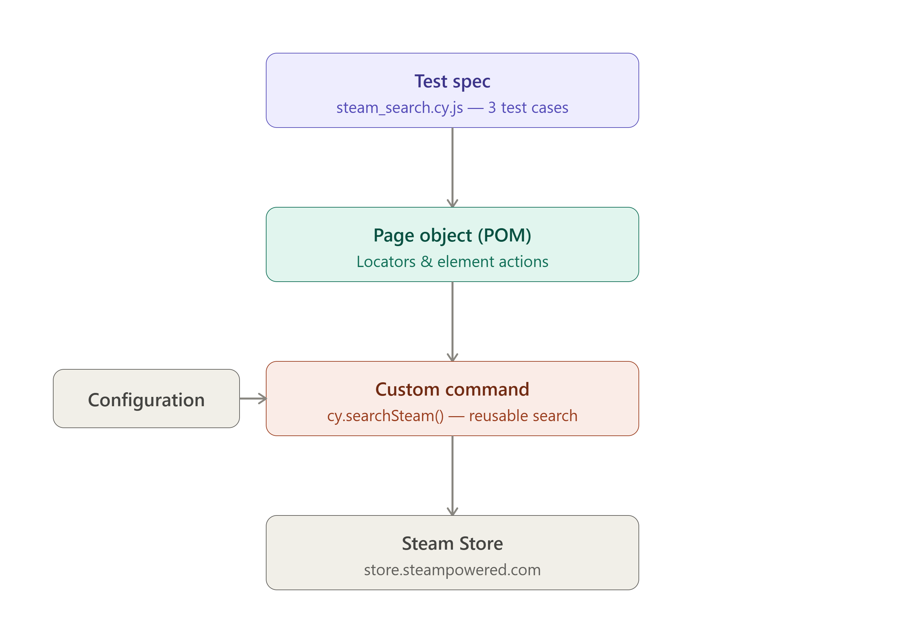

# SQA Automation

## 1. Introduction


The project uses **Cypress** to automate the Steam Store search workflow, extract game information from search results, and verify that the extracted information remains consistent after performing a new search.

The automation follows the **Page Object Model (POM)** to keep test logic, page interactions, and reusable functionality organized and maintainable.

---

## 2. Objective

The objective of this project is to automate the following Steam Store workflow:

1. Open the Steam Store.
2. Search for **"Dota 2"**.
3. Verify the search results.
4. Extract information from the first two search results.
5. Store the extracted information as JavaScript objects.
6. Re-search using the name of the second game.
7. Verify that both previously stored games are present.
8. Re-extract their information.
9. Compare the newly extracted information with the originally stored data.

The verification covers all required data fields:

* Game name
* Supported platforms
* Release date
* Review summary
* Price

---

## 3. Application Under Test

**Application:** Steam Store

**URL:**
https://store.steampowered.com/

The automation interacts with the Steam Store search functionality and its search result listings.

---

## 4. Technology Stack

| Technology        | Version / Purpose   |
| ----------------- | ------------------- |
| Cypress           | 16.1.0              |
| JavaScript        | Test implementation |
| Node.js           | Runtime environment |
| Page Object Model | Test architecture   |
| Git               | Version control     |

---

## 5. Assignment Scenario

The automation implements the complete scenario provided in the project.

### Step 1 — Navigate to Steam Store

The test opens the Steam Store homepage.

```javascript
steamStore.visit();
```

### Step 2 — Search for "Dota 2"

The test searches for the required game:

```javascript
steamStore.searchGame("Dota 2");
```

### Step 3 — Verify Search Results

The test verifies:

* The search results page is displayed.
* The search box contains `Dota 2`.
* The first result is exactly `Dota 2`.

Example:

```javascript
steamStore.firstResultName()
    .should("equal", "Dota 2");
```

### Step 4 — Extract First Two Results

The first two search results are extracted.

For each game, the following information is stored:

```text
Name
Platforms
Release Date
Review
Price
```

The extracted information is stored as JavaScript objects.

Example:

```javascript
{
    name: "Dota 2",
    platforms: ["Windows", "macOS", "Linux"],
    releaseDate: "9 Jul, 2013",
    review: "Very Positive",
    price: "Free"
}
```

### Step 5 — Re-search Using the Second Game

The name of the second stored game is used to perform another search.

```javascript
steamStore.searchGame(game2.name);
```

### Step 6 — Final Verification

The new search results are then compared with the originally stored information.

The test verifies:

* The search box contains the second game name.
* The first stored game exists.
* The second stored game exists.
* All required data for both games matches the originally stored data.

---

# 6. Project Architecture

The project follows a simple **Page Object Model architecture**.



### Architecture Flow

```text
Test Specification
       │
       ▼
SteamStorePage
       │
       ├── Navigation
       ├── Search
       ├── Result Identification
       ├── Data Extraction
       └── Data Comparison Support
       │
       ▼
Steam Store
       │
       ▼
Search Results
       │
       ▼
Extracted Game Objects
       │
       ▼
Re-search
       │
       ▼
Re-extract Data
       │
       ▼
Compare Original vs New Data
```

The architecture separates the test scenario from the implementation details of interacting with the Steam Store.

---

# 7. Project Structure

```text
assignment/
│
├── steam_test_automation_architecture.png
├── README.md
├── package.json
├── package-lock.json
├── cypress.config.js
│
└── cypress/
    │
    ├── e2e/
    │   └── steam_search.cy.js
    │
    ├── pages/
    │   └── SteamStorePage.js
    │
    └── support/
        ├── commands.js
        └── e2e.js
```

### File Responsibilities

#### `cypress/e2e/steam_search.cy.js`

Contains the actual test cases and assertions.

It defines the three main test scenarios:

* Search and verify Dota 2
* Extract the first two games
* Re-search and compare both games

#### `cypress/pages/SteamStorePage.js`

Contains the Page Object for the Steam Store.

It provides reusable methods for:

* Visiting the website
* Accessing the search box
* Searching for games
* Accessing search results
* Extracting game information
* Finding a game by name

#### `cypress/support/commands.js`

Contains custom Cypress commands.

The project includes:

```javascript
cy.searchSteam(gameName)
```

#### `cypress/support/e2e.js`

Loads the custom Cypress commands before the tests execute.

#### `cypress.config.js`

Contains the Cypress configuration and Steam Store base URL.

#### `package.json`

Contains project metadata and Cypress dependency information.

---

# 8. Page Object Model

The project uses the **Page Object Model** to separate page interactions from test scenarios.

The main Page Object is:

```text
cypress/pages/SteamStorePage.js
```

Important reusable methods include:

```javascript
visit()
searchBox()
searchGame()
searchResults()
firstResult()
firstResultName()
getGameData()
getFirstTwoGames()
findResultByName()
getGameByName()
```

For example, the test does not need to know the CSS selector for the Steam search box.

Instead, it uses:

```javascript
steamStore.searchBox()
```

This makes the test easier to read and maintain.

---

# 9. Data Extraction

The `getGameData()` method extracts all required information from an individual search result.

### Game Name

```javascript
.search_name .title
```

### Platforms

The implementation checks for:

```text
.platform_img.win
.platform_img.mac
.platform_img.linux
```

and converts them into:

```text
Windows
macOS
Linux
```

### Release Date

Extracted from:

```text
.search_released
```

### Review Summary

Extracted from:

```text
.search_review_summary
```

The review information is obtained from the element's:

```text
data-tooltip-html
```

attribute.

### Price

Extracted from:

```text
.discount_final_price
```

---

# 10. Stored Game Data

The first two search results are stored as JavaScript objects.

Each object follows this structure:

```javascript
{
    name: "...",
    platforms: [],
    releaseDate: "...",
    review: "...",
    price: "..."
}
```

The objects remain available during the test execution and are used as the reference data for the final verification.

No fixture file is required because the assignment requires the data to be dynamically extracted from the Steam Store.

---

# 11. Test Coverage

The project contains three test cases.

## Test Case 1 — Search and Verify Dota 2

```text
should search for Dota 2 and verify the first result
```

This test verifies:

* Steam Store can be opened.
* Dota 2 can be searched.
* Search results page is reached.
* Search box contains `Dota 2`.
* First result exactly matches `Dota 2`.

---

## Test Case 2 — Store First Two Search Results

```text
should store the first two search results
```

This test verifies:

* At least two search results are available.
* The first result is extracted.
* The second result is extracted.
* Both objects contain all required fields.

Required fields:

```text
name
platforms
releaseDate
review
price
```

---

## Test Case 3 — Re-search and Verify Both Games

```text
should re-search using the second game name and verify both games
```

This is the main end-to-end verification scenario.

The test:

1. Searches for `Dota 2`.
2. Extracts the first two games.
3. Stores their data.
4. Takes the second game's name.
5. Searches for that game again.
6. Verifies the search box.
7. Verifies that both stored games exist.
8. Extracts both games again.
9. Compares every required field.

---

# 12. Final Verification

The final verification is designed to satisfy the complete Step 6 requirement of the project.

## 12.1 Verify Search Box

After the re-search:

```javascript
steamStore.searchBox()
    .should("have.value", game2.name);
```

This verifies that the search box contains the second stored game's name.

---

## 12.2 Verify Both Games Exist

The test searches the new result list for both stored games:

```javascript
steamStore.findResultByName(game1.name)
    .should("exist");

steamStore.findResultByName(game2.name)
    .should("exist");
```

Therefore, the test verifies the presence of **both original games**, not just the second game.

---

## 12.3 Re-extract Game 1

The first game's current search result is extracted again:

```javascript
steamStore.getGameByName(game1.name)
```

The newly extracted object is stored as `newGame1`.

---

## 12.4 Compare Game 1

The following fields are compared:

```javascript
expect(newGame1.name)
    .to.equal(game1.name);

expect(newGame1.platforms)
    .to.deep.equal(game1.platforms);

expect(newGame1.releaseDate)
    .to.equal(game1.releaseDate);

expect(newGame1.review)
    .to.equal(game1.review);

expect(newGame1.price)
    .to.equal(game1.price);
```

---

## 12.5 Re-extract Game 2

The second game's current search result is extracted again:

```javascript
steamStore.getGameByName(game2.name)
```

The newly extracted object is stored as `newGame2`.

---

## 12.6 Compare Game 2

The following fields are compared:

```javascript
expect(newGame2.name)
    .to.equal(game2.name);

expect(newGame2.platforms)
    .to.deep.equal(game2.platforms);

expect(newGame2.releaseDate)
    .to.equal(game2.releaseDate);

expect(newGame2.review)
    .to.equal(game2.review);

expect(newGame2.price)
    .to.equal(game2.price);
```

### Final Verification Matrix

| Verification                | Game 1 | Game 2 |
| --------------------------- | :----: | :----: |
| Name                        |    ✓   |    ✓   |
| Platforms                   |    ✓   |    ✓   |
| Release Date                |    ✓   |    ✓   |
| Review                      |    ✓   |    ✓   |
| Price                       |    ✓   |    ✓   |
| Exists in re-search results |    ✓   |    ✓   |

This provides complete verification of all required stored data.

---

# 13. How the Implementation Meets the Assignment Expectations

| Requirement                | Implementation                                              |
| -------------------------- | ----------------------------------------------------------- |
| Cypress                    | Cypress 16.1.0                                              |
| JavaScript / TypeScript    | JavaScript                                                  |
| Page Object Model          | `SteamStorePage.js`                                         |
| Meaningful test names      | Descriptive test case names                                 |
| Meaningful variables       | `game1`, `game2`, `newGame1`, `newGame2`                    |
| Search for Dota 2          | `searchGame("Dota 2")`                                      |
| Search result verification | URL, search box, and first result assertions                |
| Store first two games      | `getFirstTwoGames()`                                        |
| Game name                  | Extracted and compared                                      |
| Platforms                  | Windows/macOS/Linux detection and comparison                |
| Release date               | Extracted and compared                                      |
| Review                     | Extracted and compared                                      |
| Price                      | Extracted and compared                                      |
| Re-search                  | Uses `game2.name`                                           |
| Verify both games          | `findResultByName()`                                        |
| Compare stored data        | Original objects vs newly extracted objects                 |
| Assertions                 | Cypress and Chai assertions throughout                      |
| No hardcoded waits         | No `cy.wait(5000)` used                                     |
| Custom command             | `cy.searchSteam()`                                          |
| Reusable helper methods    | Page Object methods                                         |
| README                     | Setup, architecture, execution, and verification documented |

---

# 14. Reusable Components

## Custom Cypress Command

The project includes a custom command:

```javascript
cy.searchSteam(gameName)
```

Located in:

```text
cypress/support/commands.js
```

This provides a reusable search operation.

---

## Reusable Page Object Methods

The Page Object provides reusable functionality such as:

```javascript
searchGame()
getGameData()
getFirstTwoGames()
findResultByName()
getGameByName()
```

This avoids duplicating the same selectors and interactions across test cases.

---

# 15. Assertions and Synchronization

Assertions are used throughout the test suite to verify expected application behavior.

Examples:

```javascript
.should("be.visible")
```

```javascript
.should("have.value", gameName)
```

```javascript
.should("exist")
```

```javascript
.should("equal", "Dota 2")
```

```javascript
expect(game1.price)
    .to.equal(newGame1.price)
```


---

# 16. Environment Configuration

The project uses Cypress's standard configuration file:

```text
cypress.config.js
```

The Steam Store is configured as the base URL:

```javascript
baseUrl: "https://store.steampowered.com"
```

No `cypress.env.json` file is required because in cypress 16 version this file is not included.

---

# 17. Installation

### Prerequisites

Make sure the following are installed:

* Node.js
* npm

### Install Dependencies

Clone the repository and run:

```bash
npm install
```

This installs the Cypress version specified in `package.json`.

---

# 18. Running the Tests

## Open Cypress Test Runner

```bash
npm run cy:open
```

Then:

1. Select **E2E Testing**.
2. Select a browser.
3. Select:

```text
steam_search.cy.js
```

---

## Run Tests in Headless Mode

```bash
npm run cy:run
```

This executes the complete test suite from the command line.

---

# 19. Test Artifacts

Cypress video recording is enabled in the project configuration.

```javascript
video: true
```

Test execution videos can therefore be generated under the Cypress videos directory after a headless run.

Screenshots can also be captured by Cypress when a test fails.

---

# 20. Conclusion

This project implements the complete Steam Store automation scenario defined in the project.

The solution combines:

* Cypress automation
* JavaScript
* Page Object Model
* Custom Cypress commands
* Reusable helper methods
* Dynamic data extraction
* In-memory JavaScript objects
* Comprehensive assertions
* Original vs re-searched data comparison
* Cypress retry-based synchronization
* Automated test execution and video recording

The final test verifies not only that the games can be found again, but also that **all required data fields for both stored games remain consistent after the re-search operation**.
